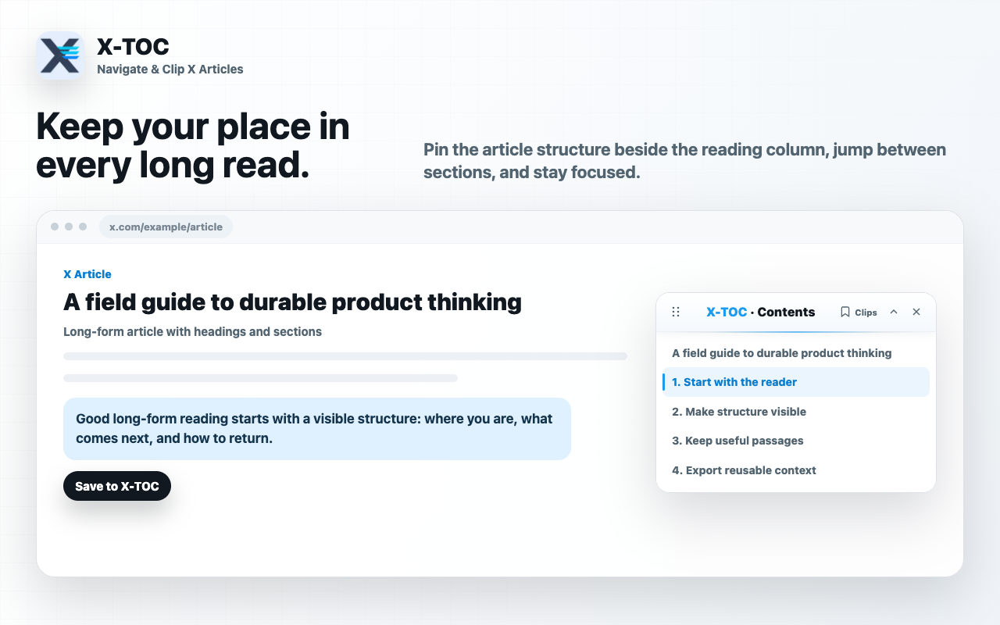

<p align="center">
  
</p>

<h1 align="center">X-TOC</h1>

<p align="center">
  <strong>跳到想读的章节，留下值得记住的原句。</strong><br>
  面向 X/Twitter 长文的轻量、开源阅读伴侣。
</p>

<p align="center">
  <a href="README.md">English</a> · 中文
</p>

<p align="center">
  <a href="https://github.com/HiAriesZhou/x-toc/releases"></a>
  <a href="LICENSE"></a>
  <a href="https://chromewebstore.google.com/detail/nbdgpckkcfkomnmdefinikjijgljgjfp?utm_source=item-share-cb"></a>
</p>

<p align="center">
  <a href="https://chromewebstore.google.com/detail/nbdgpckkcfkomnmdefinikjijgljgjfp?utm_source=item-share-cb"><strong>从 Chrome 应用商店安装</strong></a>
</p>

X-TOC 帮你浏览有标题结构的 X 长文，在阅读时连同来源上下文保存有用段落，并在读完后把摘录带到开放格式中。

<p align="center">
  
  <br>
  <sub>阅读时持续看到文章结构，并在章节之间快速跳转。</sub>
</p>

## 使用方式

1. **浏览文章。** 打开 Popup 查看识别出的标题，跳到指定章节，或把可移动的目录固定在文章旁边。
2. **保存原句。** 选中文字并点击 `save to xtoc`。X-TOC 会在本地保存原文、所属文章、可识别到的作者、时间和前后文。
3. **整理并导出。** 在 Options 中搜索摘录、添加标签或笔记、删除内容，并将全部或选中摘录导出为 Markdown 或 JSON。

## 当前已上线

- 识别 X.com 和 Twitter.com 长文标题并跳转章节。
- 在 Popup 和浮动目录中查看文章结构。
- 拖动浮动目录，并记住它的位置。
- 在支持的长文中选中文字，一键保存到本地。
- 按文章分组的摘录库，以及搜索、标签和笔记。
- 将选中摘录或全部摘录导出为 Markdown / JSON。
- 本地存储，无需单独注册 X-TOC 账号，也不会上传摘录。

当前版本会保存摘录供之后查看；它不会在原文中恢复高亮，也不会把摘录同步到云端。

## 安装

推荐直接安装 [Chrome 应用商店版本](https://chromewebstore.google.com/detail/nbdgpckkcfkomnmdefinikjijgljgjfp?utm_source=item-share-cb)。

<details>
<summary>从源码安装</summary>

```bash
git clone https://github.com/HiAriesZhou/x-toc.git
cd x-toc
npm install
npm run build
```

然后打开 `chrome://extensions/`，启用开发者模式，点击**加载已解压的扩展程序**，选择 `dist/chromium`。

</details>

## 开发

```bash
npm run dev
npm test
npm run build
npm run build:firefox
npm run build:edge
```

Chrome/Chromium 是当前有文档说明的商店与本地加载路径。Firefox 和 Edge 有各自的构建目标，分发前仍需在对应浏览器中验证。

供下游站点使用的公开产品元数据位于 [`.portfolio/project.json`](.portfolio/project.json)。发布公开版本时，请同步更新清单及其引用的资源。发布工作流可在完成配置后立即通知作品集；否则作品集会通过定时拉取发现变更。

## 隐私

摘录、标签、笔记和设置都保存在 `chrome.storage.local` 中。只有你主动操作时才会生成导出文件。X-TOC 不会把已保存的摘录发送到外部服务器。

## 项目链接

[产品网站](https://x-toc.vercel.app) · [项目案例](https://www.arieszhou.com/zh/projects/x-toc) · [参与贡献](CONTRIBUTING.md)

## 许可证

MIT。见 [LICENSE](LICENSE)。
